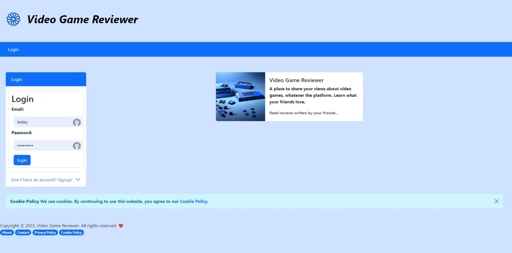

# Video Game Review

## Description
This is a video game review website deployed to heroku. It is a full stack application that uses a MySQL database, Node, Express, Supertest, and Handlebars. It follows the MVC design pattern; using Node and MySQL to query and route data in the app, and Handlebars to generate the HTML.

## Table of Contents

- [Description](#description)
- [Installation](#installation)
- [Usage](#usage)
- [Website](#website)
- [Screenshot](#screenshot)
- [Testing](#testing)
- [License](#license)
- [Contributing](#contributing)
- [Questions](#questions)
- [Credits](#credits)
- [Collaborators GitHub Profiles](#collaborators-github-profiles)

## Installation
1. Clone the repo:
``` bash
git clone git@github.com:lesley-byte/videogame-review.git
```
2. Install NPM packages:
``` bash
npm install 
```
3. Create a .env file in the root directory and add the following:
``` bash
DB_NAME='game_db'
DB_USER='yourMySQLusername'
DB_PASSWORD='yourMySQLpassword'
DB_SECRET='yourSecretCookiePassphrase'
```
4. Run the following command in the terminal to seed the database:
``` bash
 npm run seed
```
5. Run the following command in the terminal to start the application server:
``` bash
 npm start
```
6. Open your browser and navigate to:
``` bash
http://localhost:3001
```


## Usage

    You can login to the database, the database will capture your name and read and look up video game reviews. You can add platforms and games. The user can submit to the homepage and see their reviews appear on the homepage.

    
## Website  

[Link to the website](https://safe-eyrie-62856.herokuapp.com/login)

## Presentation
[Link to presenation](https://docs.google.com/presentation/d/1tYqmVuhQ94IKvixlw7p23zWb6ti1AvtPX-Ex9ajIEjs/edit#slide=id.g2038c71a101_0_15)

## Screenshot




## Testing
Enter one of the following commands in to the terminal after the server is started:
```bash
 npm run test
```
 or 
 ```bash
 node server.js. 
```

## License

MIT License


## Contributing

We are not currently looking for contributors. If you would like to contribute, please contact us. See our
section on [Questions](#questions) for contact information.

## Questions

If you have any questions about the repo, open an issue or contact us directly at:


## Credits

We would like to thank the following people for their help:

- Instructor - [Kevin Ferguson](https://github.com/kfergrocks)
- TA's [Ringo](https://github.com/RingoKam), [Reese]() and [Juan]()
- Tutors
- Classmates

## Collaborators GitHub Profiles:

You can find more of our work at the following links:

- [Phadeline](https://github.com/phadeline)
- [Joey](https://github.com/joeyblue27)
- [Ryan](https://github.com/ryancarless96)
- [Lesley](https://github.com/lesley-byte)